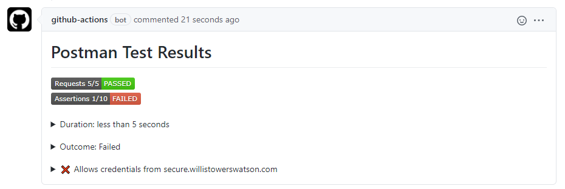
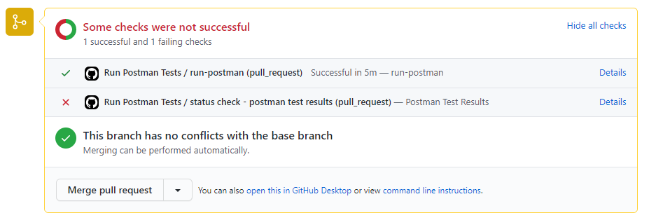
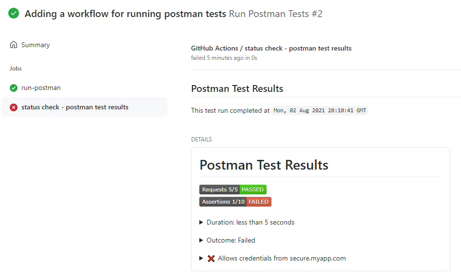
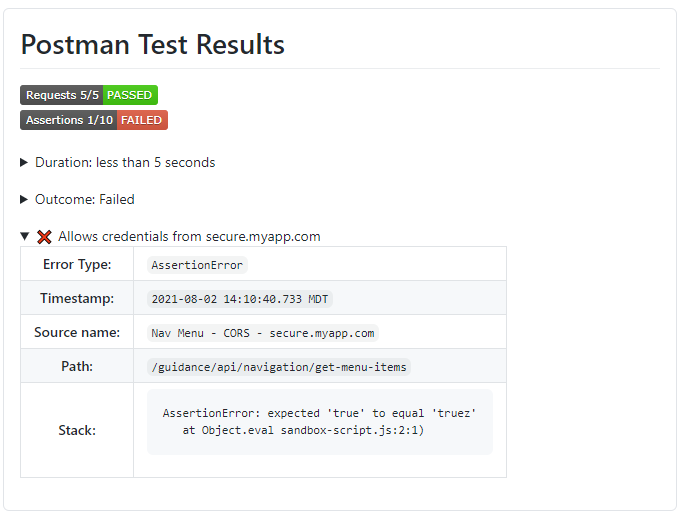

# process-postman-test-results

This action works in conjunction with another step that runs Postman tests.  That step should include a json reporter like the following npm script: 
`"postman": "newman run postman_collection.json -r cli,json -reporter-json-export postman-results.json"`.  

This action takes the json file and creates a Status Check or PR Comment depending on the flags set with the test outcome.  This action does not execute the tests itself, it relies on a previous step to run the Postman tests.  It can only process one result file.

## Index

- [Failures](#failures)
- [Limitations](#limitations)
- [Action Outputs](#action-outputs)
  - [Pull Request Comment](#pull-request-comment)
  - [Pull Request Status Check](#pull-request-status-check)
  - [Workflow Run](#workflow-run)
  - [Failed Test Details](#failed-test-details)
- [Inputs](#inputs)
- [Outputs](#outputs)
- [Usage Examples](#usage-examples)
  - [npm setup](#npm-setup)
  - [Workflow](#workflow)
- [Contributing](#contributing)
  - [Recompiling](#recompiling)
  - [Incrementing the Version](#incrementing-the-version)
- [Code of Conduct](#code-of-conduct)
- [License](#license)

## Failures
The status check can be an item on the workflow run, a PR comment or on the PR Status Check section.  If the test results contain failures, the status check will be marked as failed. Having the status check marked as failed will prevent PRs from being merged. If this status check behavior is not desired, the `ignore-test-failures` input can be set and the outcome will be marked as neutral if test failures are detected. The status badge shown in the comment or status check body will still indicate a failure.

## Limitations
GitHub does have a size limitation of 65535 characters for a Status Check body or a PR Comment.  This action will fail if the test results exceed the GitHub limit.  To mitigate this size issue only failed tests are included in the output.

If you have multiple workflows triggered by the same `pull_request` or `push` event, GitHub creates one checksuite for that commit.  The checksuite gets assigned to one of the workflows randomly and all status checks for that commit are reported to that checksuite. That means if there are multiple workflows with the same trigger, your status checks may show on a different workflow run than the run that created them.

## Action Outputs
### Pull Request Comment
This is shown on the pull request when the `create-pr-comment` is set to `true` and there is a PR associated with the commit.
<kbd></img></kbd>

### Pull Request Status Check
This is shown on the pull request when the `create-status-check` is set to `true` and there is a PR associated with the commit.
<kbd></img></kbd>

### Workflow Run
This is shown on the workflow run when the `create-status-check` is set to `true`.
<kbd></img></kbd>

### Failed Test Details
For failed test runs you can expand each failure to view more details.
<kbd></img></kbd>

## Inputs
| Parameter                      | Is Required | Default              | Description                                                                                                                                                                         |
| ------------------------------ | ----------- | -------------------- | ----------------------------------------------------------------------------------------------------------------------------------------------------------------------------------- |
| `github-token`                 | true        | N/A                  | Used for the GitHub Checks API.  Value is generally: secrets.GITHUB_TOKEN.                                                                                                          |
| `results-file`                 | true        | N/A                  | The json test results file generated by the postman/newman json reporter.                                                                                                           |
| `report-name`                  | false       | Postman Test Results | The desired name of the report that is shown on the PR Comment and inside the Status Check.                                                                                         |
| `create-status-check`          | false       | true                 | Flag indicating whether a status check with postman test results should be generated.                                                                                               |
| `create-pr-comment`            | false       | true                 | Flag indicating whether a PR comment with postman test results should be generated.  When `true` the default behavior is to update an existing comment if one exists.               |
| `update-comment-if-one-exists` | false       | true                 | When `create-pr-comment` is true, this flag determines whether a new comment is created or if the action updates an existing comment if one is found which is the default behavior. |
| `ignore-test-failures`         | false       | `false`              | When set to true the check status is set to `Neutral` when there are test failures and it will not block pull requests.                                                             |
| `timezone`                     | false       | `UTC`                | IANA time zone name (e.g. America/Denver) to display dates in.                                                                                                                      |


## Outputs
| Output         | Description                                                                                                                                                           |
| -------------- | --------------------------------------------------------------------------------------------------------------------------------------------------------------------- |
| `test-outcome` | Test outcome based on presence of failing tests: *Failed,Passed*<br/>If exceptions are thrown or if it exits early because of argument errors, this is set to Failed. |

## Usage Examples
### npm setup
1. Some npm scripts have also been added to the project
    ```json
    "scripts": {
      "postman": "newman run postman_collection.json -r cli,json -reporter-json-export postman-results.json"
    }
    ```

### Workflow

```yml
env:
  PACKAGE_JSON_DIR: 'src'                       # The directory containing package.json
  POSTMAN_NPM_SCRIPT_NAME: 'postman'            # The name of the postman script in package.json
  POSTMAN_RESULTS_NAME: 'postman-results.json'  # The name of the results file set in npm script in package.json

jobs:
  run-postman:
    runs-on: ubuntu-20.04

    defaults:
      run:
        shell: bash
        working-directory: ${{ env.PACKAGE_JSON_DIR }}

    steps:
      - uses: actions/checkout@v2

      - name: Restore npm packages
        run: npm install

      - name: Run Postman Tests
        continue-on-error: true
        run: npm run ${{ env.POSTMAN_NPM_SCRIPT_NAME }}

      - name: Create Status check based on postman results
        id: process-postman
        uses: im-open/process-postman-test-results@v2.0.4
        with:
          github-token: ${{ secrets.GITHUB_TOKEN }}
          results-file: ${{env.PACKAGE_JSON_DIR }}/${{ env.POSTMAN_RESULTS_NAME }}
          report-name: 'Postman ${{ github.run_number }}'     # Default: Postman Test Results
          create-status-check: true                           # Default: true
          create-pr-comment: false                            # Default: true
          update-comment-if-one-exists: false                 # Default: true
          ignore-test-failures: true                          # Default: false
          timezone: 'america/denver'                          # Default: UTC
      
      - name: Fail if there were errors in the postman tests
        if: steps.process-postman.outputs.test-outcome == 'Failed'
        run: |
          echo "There were postman failures."
          exit 1
```

## Contributing

When creating new PRs please ensure:
1. The action has been recompiled.  See the [Recompiling](#recompiling) section below for more details.
2. For major or minor changes, at least one of the commit messages contains the appropriate `+semver:` keywords listed under [Incrementing the Version](#incrementing-the-version).
3. The `README.md` example has been updated with the new version.  See [Incrementing the Version](#incrementing-the-version).
4. The action code does not contain sensitive information.

### Recompiling

If changes are made to the action's code in this repository, or its dependencies, you will need to re-compile the action.

```sh
# Installs dependencies and bundles the code
npm run build

# Bundle the code (if dependencies are already installed)
npm run bundle
```

These commands utilize [esbuild](https://esbuild.github.io/getting-started/#bundling-for-node) to bundle the action and
its dependencies into a single file located in the `dist` folder.

### Incrementing the Version

This action uses [git-version-lite] to examine commit messages to determine whether to perform a major, minor or patch increment on merge.  The following table provides the fragment that should be included in a commit message to active different increment strategies.
| Increment Type | Commit Message Fragment                     |
| -------------- | ------------------------------------------- |
| major          | +semver:breaking                            |
| major          | +semver:major                               |
| minor          | +semver:feature                             |
| minor          | +semver:minor                               |
| patch          | *default increment type, no comment needed* |

## Code of Conduct

This project has adopted the [im-open's Code of Conduct](https://github.com/im-open/.github/blob/master/CODE_OF_CONDUCT.md).

## License

Copyright &copy; 2021, Extend Health, LLC. Code released under the [MIT license](LICENSE).

[limit]: https://github.com/github/docs/issues/3765
[Only GitHub apps]: https://docs.github.com/en/rest/reference/checks#check-suites
[git-version-lite]: https://github.com/im-open/git-version-lite
